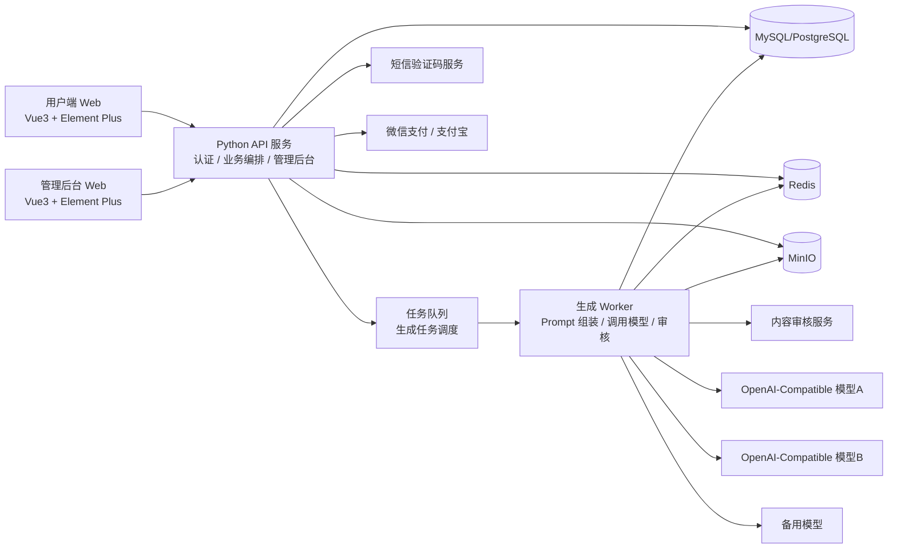
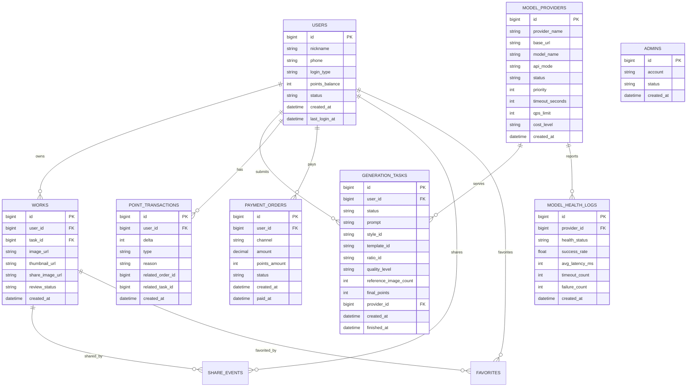

# 系统设计: AI 国风角色与梦女人设生成平台

**基于 PRD**: v1.0  
**设计日期**: 2026-05-18  
**状态**: 已确认

---

## 1. 整体架构

### 1.1 架构图（Mermaid）

### 1.2 模块职责

| 模块 | 职责 | 技术选型 | 选型理由 |
|---|---|---|---|
| 用户端 Web | 首页转化、生成流程、作品页、分享页 | Vue3 + Element Plus | 与项目技术栈一致，适合快速搭建复杂页面 |
| 管理后台 | 用户管理、模型配置、状态监控、运营维护 | Vue3 + Element Plus | 与前台共栈，降低维护成本 |
| Python API 服务 | 登录、积分、支付、用户信息、后台接口、任务下发 | Python 3.11 Web API | 适合快速实现业务编排与后台能力 |
| 任务队列 | 异步生成、削峰、失败重试、状态流转 | Redis Queue / Celery 类方案 | 图像生成不能同步阻塞，请求与执行需解耦 |
| 生成 Worker | Prompt 组装、模型路由、审核、结果存储 | Python Worker | 与主服务同语言，便于复用模型调用和审核逻辑 |
| 模型适配层 | 屏蔽多个 OpenAI-compatible 服务差异 | Adapter Pattern | 支持多模型配置、主备切换、降级 |
| 缓存层 | 登录态、限流、Prompt 结果缓存、任务状态缓存 | Redis | 低延迟，适合频繁读写和限流 |
| 对象存储 | 参考图、生成图、分享图存储 | MinIO | 已在 PRD 中确认，支持私有部署 |
| 关系数据库 | 用户、积分、订单、作品、模型配置、监控数据 | MySQL 或 PostgreSQL | 管理后台和交易类数据适合关系模型 |

---

## 2. 后端设计

### 2.1 API 接口设计

| 端点 | 方法 | 描述 | 请求体 | 响应 |
|---|---|---|---|---|
| `/api/auth/sms/send-code` | `POST` | 发送手机验证码 | phone | success |
| `/api/auth/login` | `POST` | 手机号验证码登录 | phone, code | token, user |
| `/api/prompts/inspirations` | `GET` | 获取推荐 Prompt / 随机灵感 | query | prompt list |
| `/api/styles` | `GET` | 获取风格列表 | - | styles |
| `/api/templates` | `GET` | 获取模板列表/热门模板 | style_id | templates |
| `/api/generate/quote` | `POST` | 计算本次生成积分消耗 | ratio, style, template, refs, quality | points quote |
| `/api/generate/tasks` | `POST` | 创建生成任务 | prompt, params, refs | task_id, status |
| `/api/generate/tasks/{id}` | `GET` | 查询任务状态 | - | task detail |
| `/api/works` | `GET` | 我的作品列表 | page, filter | works |
| `/api/works/{id}` | `GET` | 作品详情 | - | work detail |
| `/api/works/{id}/share` | `POST` | 生成分享素材与链接 | - | share payload |
| `/api/user/profile` | `GET` | 获取当前用户信息 | - | profile |
| `/api/user/points` | `GET` | 获取积分余额与流水 | - | points |
| `/api/pay/orders` | `POST` | 创建充值订单 | package_id, channel | order |
| `/api/pay/callback/{channel}` | `POST` | 支付回调 | provider payload | ack |
| `/api/admin/login` | `POST` | 管理员登录 | account, password | admin token |
| `/api/admin/users` | `GET` | 用户列表检索 | keyword, status | users |
| `/api/admin/users/{id}` | `GET` | 用户详情 | - | user detail |
| `/api/admin/users/{id}/points` | `PATCH` | 调整用户积分 | delta, reason | updated |
| `/api/admin/users/{id}/status` | `PATCH` | 冻结/解冻用户 | status | updated |
| `/api/admin/model-providers` | `GET/POST` | 查看/新增模型配置 | config | providers |
| `/api/admin/model-providers/{id}` | `PATCH` | 更新模型配置 | config patch | updated |
| `/api/admin/model-providers/{id}/status` | `PATCH` | 启停模型 | status | updated |
| `/api/admin/model-monitoring` | `GET` | 获取模型状态监控 | filters | monitoring |

### 2.2 核心业务逻辑

#### 生成主链路

1. 用户选择 Prompt、风格、模板、比例、参考图和质量档
2. API 服务先校验登录态、积分、限流、Prompt 合规性
3. 调用积分报价服务，返回最终积分消耗
4. 用户确认后创建生成任务，写入数据库和队列
5. Worker 消费任务，组装增强 Prompt 与参考图参数
6. 根据模型路由规则选择默认模型或备用模型
7. 调用 OpenAI-compatible 文生图接口
8. 生成结果先进入图片审核流程
9. 审核通过后写入 MinIO、保存作品记录、更新任务状态为 `success`
10. 审核失败或模型失败则触发兜底策略，如退款、重试或降级

#### 多模型路由逻辑

1. 按模型配置中心读取启用中的模型
2. 优先使用默认主模型
3. 若主模型状态为 `degraded` 或 `unavailable`，自动切到备用模型
4. 对不同模型适配请求字段、超时参数和能力标签
5. 记录每次调用的成功率、耗时、错误码和成本等级

#### 分享回流逻辑

1. 用户点击分享后，系统生成分享图和分享文案
2. 生成带追踪参数的回流链接
3. 新用户打开链接后进入首页并记录来源渠道与分享人
4. 新用户首次登录时自动创建账号并发放新手免费积分
5. 系统统计分享率、回流数和回流转生成率

### 2.3 错误处理策略

- `400`：参数非法、Prompt 超长、参考图格式错误
- `401`：未登录
- `403`：无权限、游客试图生成、管理员权限不足
- `404`：作品、任务、模型配置不存在
- `409`：积分不足、订单状态冲突、重复回调
- `422`：内容审核不通过、业务规则校验失败
- `429`：触发限流或防刷
- `500`：内部服务异常
- `502/504`：模型服务异常或超时

异常策略：
- 生成失败自动退款积分
- 模型超时自动重试 1 次
- 主模型故障自动切备用模型
- 所有管理员修改操作必须经过权限校验与二次确认

---

## 3. 数据库设计

### 3.1 ER 图（Mermaid）

### 3.2 表结构

核心表：
- `users`：用户基础信息、登录标识、积分余额、状态
- `generation_tasks`：生成任务请求参数、任务状态、模型路由信息
- `works`：生成作品与审核结果
- `point_transactions`：积分流水，支持退款与充值对账
- `payment_orders`：支付订单
- `share_events`：分享与回流跟踪
- `favorites`：收藏关系
- `model_providers`：多模型配置
- `model_health_logs`：模型监控快照
- `admins`：管理员账号

索引策略：
- `users(phone)` 唯一索引
- `generation_tasks(user_id, created_at)` 联合索引
- `generation_tasks(status, created_at)` 联合索引
- `works(user_id, created_at)` 联合索引
- `payment_orders(user_id, status)` 联合索引
- `model_providers(status, priority)` 联合索引

### 3.3 数据迁移方案

- 首次建设按模块分批创建用户、任务、作品、积分、支付和模型配置表
- 后续模型能力扩展通过迁移脚本新增字段，不直接手工修改线上库
- 生成任务和模型健康日志建议预留归档策略，避免主表无限膨胀

---

## 4. 前端边界（如适用）

### 4.1 页面/模块边界

用户端：
- 首页
- 生成工作台
- 登录弹窗/页面
- 结果页
- 我的作品页
- 收藏页
- 积分页 / 充值页

管理后台：
- 管理员登录页
- 用户管理页
- 用户详情页
- 模型配置中心
- 模型监控页

### 4.2 前后端交互约束

- 所有前端页面通过统一 API 层调用，不在视图层拼接业务逻辑
- 生成任务采用“创建任务 + 后端SSE通知生成完毕+后端查询”模式，不走长时间同步等待
- 上传参考图先上传 MinIO，再提交生成任务
- 分享回流链接必须带渠道和分享来源标识
- 管理后台所有修改类操作必须带管理员 token

### 4.3 需要进入 `/adpp:ux` 继续细化的部分

- 首页转化结构、情绪化模板展示和案例区布局
- 生成工作台的参数面板与积分报价展示
- 结果页、分享图、分享流程与回流承接页
- 充值页和套餐展示
- 用户作品页与收藏页
- 管理后台信息架构与模型监控面板

---

## 5. 安全设计

- 鉴权方案：用户侧采用 token 鉴权；管理员侧采用独立管理员鉴权与会话控制
- 敏感数据处理：手机号按权限脱敏展示；密钥不入库明文
- 输入校验：前后端双重校验 Prompt、参考图、支付参数、管理员操作参数
- 危险操作保护：积分调整、冻结用户、模型切换等操作必须二次确认并校验管理员身份
- 内容审核：Prompt 预审核 + 图片生成后审核
- RBAC：管理员分角色控制，仅授权人员可查看或维护用户信息与模型配置
- 限流：游客禁生成；新用户每日次数限制；IP 限流；Prompt 重复防刷
- 缓存安全：缓存命中仅可复用自己可访问的公共或用户所属结果，禁止越权复用

---

## 6. 方案对比（至少给出 2 个方案）

| 维度 | 方案 A (推荐) | 方案 B |
|---|---|---|
| 架构形态 | 单体 API + 异步 Worker + 模型适配层 | 前后端分离微服务化，多独立服务 |
| 实现复杂度 | 中 | 高 |
| 性能 | 足够支撑 MVP 和初期增长 | 更强，但初期收益有限 |
| 可维护性 | 同语言后端 + 清晰模块边界，适合 1 人团队 | 边界更清楚，但运维和协作复杂 |
| 开发周期 | 短 | 长 |
| 多模型支持 | 通过统一适配层支持 | 通过独立模型网关支持 |
| **推荐理由** | 更适合当前 1 人团队、Web MVP 和快速验证闭环 | 更适合未来规模化，但当前成本过高 |

推荐结论：
- 采用 **方案 A**：`Vue3 前后端分离界面 + Python 单体业务服务 + Redis 队列 Worker + MinIO + 关系数据库 + 统一模型适配层`

---

## 7. 技术风险

| 风险 | 影响 | 概率 | 应对措施 |
|---|---|---|---|
| 多模型 OpenAI-compatible 协议细节不一致 | 影响模型接入稳定性 | 高 | 设计统一适配层，按 provider 做字段映射与超时封装 |
| 图像生成耗时和失败率波动 | 影响用户体验和成本 | 高 | 队列异步化、自动重试、主备模型切换、失败退款 |
| 审核链路复杂 | 影响合规和误杀体验 | 高 | Prompt 预审 + 图片后审 + 审核状态记录 |
| 后台权限与敏感信息风险 | 影响数据安全 | 中 | RBAC、脱敏展示、二次确认 |
| 分享回流闭环效果不达预期 | 影响增长 | 中 | 在 UX 阶段重点设计分享素材和承接页 |
| 缓存命中策略不当 | 影响版权或错误复用 | 中 | 仅对同参数安全场景复用，并记录缓存来源 |
